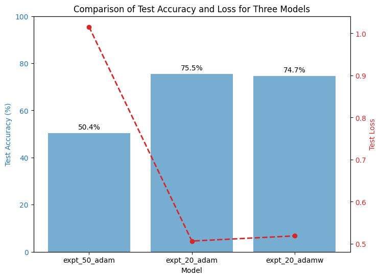

# Electron/Photon Classification with ResNet-15

This directory contains a ResNet-15-based model to classify electrons and photons based on hit energy and time data from particle detectors. The model is implemented using PyTorch and is trained on 32×32 matrix inputs with two channels (hit energy and time). Three experiments were conducted using different optimizers with different epoch counts, and their performance is compared.

---

## Project Structure

```
GSoC_Evaluation_CMS\Task1\
│
├── models.py                # ResNet-15 model definition
├── train.py                 # Training and evaluation script
├── comparison.png           # Performance comparison plot
├── README.md                # Project description
├── data/                   # Directory for dataset files (not included)
└── expt_20_adam/           # Model weights for 20-epoch run with adam optimizer
└── expt_20_adam/           # Model weights for 20-epoch run with adamw optimizer
└── expt_50_adam/           # Model weights for 50-epoch run with adam optimizer
```

---

## Task Description

### Goal:
Develop a classifier to distinguish between electrons and photons based on detector data.

### Dataset:
- **SingleElectronPt50_IMGCROPS_n249k_RHv1.hdf5** – Electron dataset
- **SinglePhotonPt50_IMGCROPS_n249k_RHv1.hdf5** – Photon dataset

### Input:
- 32×32 matrices with 2 channels:
  - **Channel 1:** Hit energy
  - **Channel 2:** Hit time

---

## Model Architecture

The model is based on a modified ResNet-18 backbone (referred to as ResNet-15) with the following changes:
- **Input Layer:** Modified to accept 2 channels.
- **Spatial Resolution:** The maxpool layer is removed to retain resolution.
- **Layer Modification:** The fourth block (`layer4`) is replaced by an identity mapping.
- **Additional Block:** A new convolutional block is added after the initial convolution.
- **Output Layer:** The final fully connected layer is adjusted for binary classification (electrons vs. photons).

---

## How to Run

### 1. Install Dependencies:
Make sure you have the required libraries installed. You can install them using:
```bash
pip install -r requirements.txt
```

### 2. Train the Model:
Run the training script with your desired experiment settings. For example:
```bash
python train.py --runname expt_50_adam --epochs 50 --batch_size 32 --lr 0.001 --optim adam --device cuda
```

### 3. Evaluate the Model:
After training, evaluate your model. For example:
```python
import torch
from models import resnet15v2
from train import get_dataloaders, evaluate

device = torch.device('cuda' if torch.cuda.is_available() else 'cpu')
model = resnet15v2()
model.load_state_dict(torch.load('expt_50_adam/best.pth', map_location=device))
model.to(device)

# Load the data loaders
train_loader, test_loader = get_dataloaders(batch_size=32)

criterion = torch.nn.BCEWithLogitsLoss()
test_acc, test_loss = evaluate(model, criterion, test_loader, device)
print(f'Test Accuracy: {test_acc * 100:.2f}%, Test Loss: {test_loss:.4f}')
```

---

## Model Comparison

The experiments were conducted with the Adam optimizer using different epoch settings. Below is a comparison of their performance:

| Model Name     | Optimizer | Epochs | Test Accuracy (%) | Test Loss |
|----------------|-----------|--------|-------------------|-----------|
| expt_50_adam   | Adam      | 50     | **50.40%**         | **1.01** |
| expt_20_adamw   | AdamW      | 20     | **74.70%**         | **0.50** |
| expt_20_adam   | Adam      | 20     | **75.50%**         | **0.51** |

### Performance Comparison Plot



---

## Results & Findings

- The **expt_20_adam** experiment (20 epochs) achieved the highest accuracy among the three experiments.
- The **expt_50_adam** seems to undergo overfitting.
- The **expt_20_adamw** holds similar performance as in case of Adam Optimizer
- Adjustments in the model architecture (such as removing the maxpool layer and modifying the backbone) significantly contributed to improved classification performance.

## Author

- **Kartik Bhatt**  
- 📧 kartikbhtt7@gmail.com