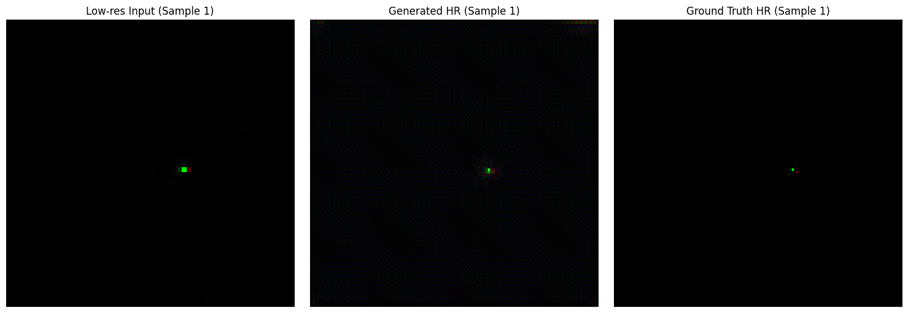
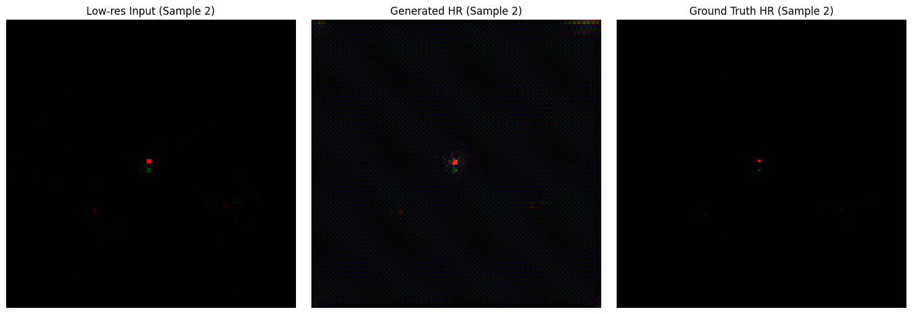
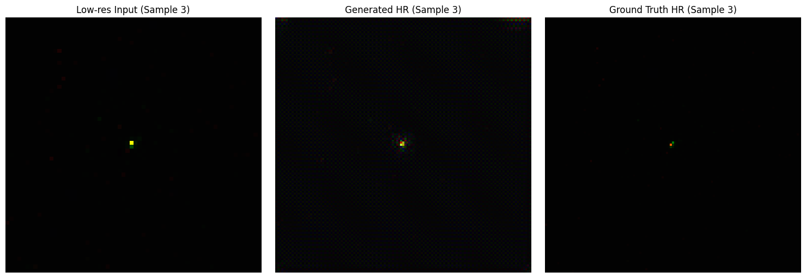

# ESRGAN for Particle Physics Data Super-Resolution

This project implements an Enhanced Super-Resolution Generative Adversarial Network (ESRGAN) to improve the resolution of particle physics image data. The model takes low-resolution (LR) particle collision images and generates high-resolution (HR) counterparts, enabling better analysis and visualization.

## Project Overview
The ESRGAN model is based on a generator-discriminator architecture:
- **Generator:** Uses Residual-in-Residual Dense Blocks (RRDB) to generate high-resolution images.
- **Discriminator:** Uses relativistic average GAN loss to distinguish between real and generated images.
- **Feature Extractor:** Based on VGG19, extracts high-level features for content loss calculation.

---

## Directory Structure
```
├── data/                           # Input parquet files
├── images/training                 # Output generated images
├── saved_models/                   # Saved model checkpoints
├── datasets.py                     # Custom dataset loader
├── esrgan.py                       # Training and validation script
├── models.py                       # Generator, Discriminator, Feature Extractor
├── utils.py                        # Utility functions
├── requirements.txt                # Dependencies
└── README.md                       # Project documentation
```

---

## Dataset
The dataset consists of particle physics data stored in **Parquet** format:
- **X_jets_LR** – Low-resolution images `(3, 64, 64)`
- **X_jets** – High-resolution images `(3, 125, 125)`
- **y** – Associated label

---

## Model Architecture
### **Generator**
- Uses Residual-in-Residual Dense Blocks (RRDB).
- Upsamples input using sub-pixel convolution.
- Applies pixel shuffle for precise resizing.

### **Discriminator**
- Uses convolutional layers with increasing depth.
- Implements relativistic average GAN loss.

### **Feature Extractor**
- Uses VGG19 pretrained on ImageNet.
- Extracts high-level features for content loss calculation.

---

## Usage

1. Create a virtual environment:
```bash
python -m venv venv
source venv/bin/activate
```

2. Install dependencies:
```bash
pip install -r requirements.txt
```

3. Prepare your dataset (in `data/`).

4. Train the model:
```bash
python esrgan.py --n_epochs 200 --batch_size 4 --lr 0.0002
```

5. Training evaluation and generated images will be saved in `images/training/`.

---

## Compute & Training Notes
Due to limited available compute power, the model was trained for only **5 epochs** using an **L40 GPU** from Lightning AI's free credits. As a result, the generated images are not yet perfect, and more training may lead to better convergence and improved output quality.

---

## 📊 Results  
### **Sample Outputs**  
Below are example outputs from the trained model:

  

  

  

- **Left:** Low-Resolution (Input)  
- **Center:** Generated HR (ESRGAN)  
- **Right:** High-Resolution (Ground Truth)

---

## 📈 Performance Metrics
- **Adversarial Loss:** Measures how well the generator fools the discriminator.
- **Content Loss:** Measures how well generated features match real features.
- **Pixel Loss:** Measures pixel-level accuracy between generated and real HR images.

---

## References
[Research Paper Directory](https://www.dropbox.com/scl/fo/9agote4l4m586hch4duh6/ACoqBkbhS8d4DoW6f4Fkao8?rlkey=r6oxoa2e033cmvgbeu9yzm3qo&st=g7l1xj55&dl=0)

1. **ESRGAN: Enhanced Super-Resolution Generative Adversarial Networks** – Wang et al.  
2. **Photo-Realistic Single Image Super-Resolution Using a Generative Adversarial Network** – Ledig et al.  
3. **Generative Adversarial Networks** – Goodfellow et al.  
4. **Generative Adversarial Networks for Image Super-Resolution: A Survey** – Yang et al.  
5. **Guided Frequency Loss for Image Restoration** – Li et al.

---

## Author

- **[Kartik Bhatt]**  
- 📧 [kartikbhtt7@gmail.com]

---